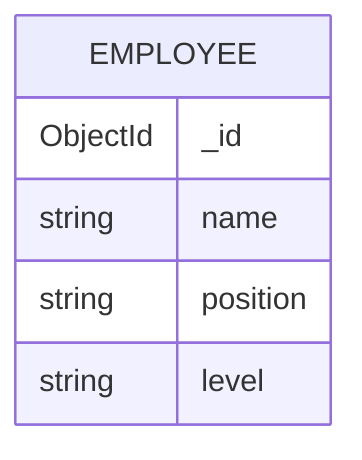

# EDD.md

## Overview

This EDD defines the MongoDB data model for the MEAN employee management application.

- Database: `meanStackExample`
- Primary collection: `employees`
- Code source of truth: `server/src/database.ts`

## Entities

### Employee

Collection: `employees`

Purpose:

- Stores employee records managed through the Angular UI and Express API.

Fields:

| Field | BSON Type | Required | Constraints | Description |
| --- | --- | --- | --- | --- |
| `_id` | `ObjectId` | No | Generated by MongoDB | Primary key |
| `name` | `string` | Yes | Must be a string | Employee display name |
| `position` | `string` | Yes | `minLength: 5` | Employee role/title |
| `level` | `string` | Yes | Enum: `junior`, `mid`, `senior` | Seniority level |

Validation contract:

- Required fields: `name`, `position`, `level`
- `additionalProperties: false`
- `position` minimum length: `5`
- `level` enum values: `junior`, `mid`, `senior`

Indexes:

- Default `_id` index
- No additional application-managed indexes

Relationships:

- No cross-collection references

## API Mapping

| Route | Collection Action |
| --- | --- |
| `GET /employees` | List documents from `employees` |
| `GET /employees/:id` | Fetch one document by `_id` |
| `POST /employees` | Insert a new document |
| `PUT /employees/:id` | Update fields on an existing document |
| `DELETE /employees/:id` | Delete a document by `_id` |

## Mermaid Diagram

