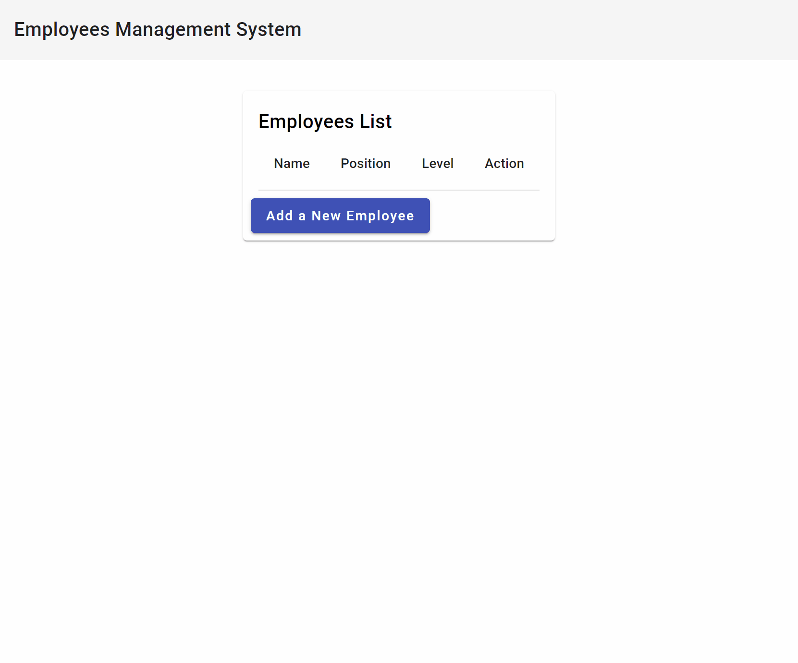

# MEAN Stack Sample Application

This is a simple CRUD application built using the MEAN (MongoDB, Express, Angular, Node.js) stack. You can also follow the step-by-step [tutorial](https://www.mongodb.com/languages/mean-stack-tutorial) for building this application.


Wide
Latest comment: just now by Winston Sung in topic Change to translatewiki.net/Miraheze-Meta page translation target languages
 ← Index of discussion pages
Babel
archives (latest) →
This is the general discussion forum for Meta (this wiki). Before you post a new comment please note the following:
You can comment here in any language.
This forum is primarily for discussion of Meta policies and guidelines, and other matters that affect more than one page of the wiki.
If your comment only relates to a single page, please post it on the corresponding discussion page (if necessary, you can provide a link and short description here).
For notices and discussions related to multilingualism and translation, see Meta:Babylon and its discussion page.
For information about how to indicate your language abilities on your user page ("Babel templates"), see User language.
To discuss Wikimedia in general, please use the Wikimedia Forum.
Consider whether your question or comment would be better addressed at one of the major Wikimedia "content projects" instead of here.
Wikimedia Meta-Wiki
About Meta
Discussion pages
Request pages
Policies and guidelines
Information and statistics
Categories
Help pages
Meta-Wiki discussion page
This box: view · talk · edit
	SpBot archives all sections tagged with {{Section resolved|1=~~~~}} after 1 day and sections whose most recent comment is older than 30 days.
Communication
Wikimedia Social Suite
Meetup
Babel
Distribution list
ComCom
Mailing lists
Overview
Administration
Standardization
List info template
Unsubscribing
Wikimedia IRC
Channels listing
#wikidata-admin
#wikimedia-admin
#wikipedia-en-admins
Channel operators
#wikimedia-admin
#wikipedia-en-admins
#wikipedia and #wikipedia-en
Instructions
Guidelines
#wikipedia
Group Contacts
Noticeboard & Log
Cloaks
Bots
FAQ
Stalkwords
Quotes (en)
archives
Quotes (fr)
Other chat networks
Telegram
Discord
Matrix.org
Signal
Steam
[Edit]
Change to translatewiki.net/Miraheze-Meta page translation target languages
Latest comment: just now
5 comments
2 people in discussion
Currently, the page translation target language configuration on Wikimedia Meta-Wiki were inherited from the "language converter page translation model".

However, this actually created several problems including the broken page transclutions with malfunctioned language converter tags exposed and using the workaround of Template:Conversion-zh, Template:LC zh. More breakages could be found on phab:T328838.

I would like to propose to use the "translatewiki.net page translation model"/"Miraheze Meta page translation model" instead on Meta-Wiki after the related proposal had been discussed, supported and approved and changes had been done on Wikifunctions.

Below are examples of the proposed translation model.

https://translatewiki.net/wiki/Special:Translate?group=page-Project%3AAbout&action=page&language=zh-hans&filter=
https://translatewiki.net/wiki/Special:Translate?group=page-Project%3AAbout&action=page&language=zh-hant&filter=
https://meta.miraheze.org/wiki/Special:Translate?group=page-Miraheze+Meta&action=page&language=zh-hans&filter=
https://meta.miraheze.org/wiki/Special:Translate?group=page-Miraheze+Meta&action=page&language=zh-hant&filter=
More briefly for the zh part: The old configuration can only translate into zh while the new configuration can translate into zh-hans (for zh-Hans-CN, zh-Hans-MY, zh-Hans-SG), zh-hant (for zh-Hant-TW) and zh-hk (for zh-Hant-HK, zh-Hant-MO).

Without using /zh-hans, /zh-hant, /zh-hk, we have to pass the language tag every time using message bundle messages.

-- Wrapping all of them under /zh using {{LC zh|, without using /zh-hans, /zh-hant, /zh-hk
tmb.new( mb_page_title, lang_tag ):t( message_key ):params( lang_tag ):plain()
-- Using separated /zh-hans, /zh-hant, /zh-hk, we no longer need to pass the language tag :params( lang_tag ) every time
tmb.new( mb_page_title, lang_tag ):t( message_key ):plain()
With this change, every Lua module using translation bundles can be simplified:

- :t( message_key ):params( lang_tag ):plain()
+ :t( message_key ):plain()
Without this change, every Lua module using translation bundles need to:

- :t( message_key ):plain()
+ :t( message_key ):params( lang_tag ):plain()
Note: "translatewiki.net page translation model"/"Miraheze Meta page translation model" refer to the same translation model.

-- Winston Sung (talk) 07:57, 30 July 2025 (UTC)

Pinging @​94rain @​乌拉跨氪 @​梦夕琳 ​@Allenwang6212a、 @ASid @Cookai1205 @​Cwek @​Ericliu1912 @​Hamish @​Heihaheihaha @​Joycewikiwiki @​Kaganer @​KOKUYO @​Kuailong @Lakejason0 @​LowensteinYang @​Minorax @​Reke @SCP-2000 @​Shangkuanlc @​Shizhao @SolidBlock @​Stang @​SunAfterRain @​Supaplex @​Taiwania Justo @​Tigerzeng @​Venuslui @​WhitePhosphorus @​Wong128hk @​Xiplus @​YFdyh000 @人间百态 @魔琴 @​だ＊ぜ -- Winston Sung (talk) 04:24, 5 August 2025 (UTC)
As I didn't look into two models, is there any major difference? If yes, would you briefly describe the difference please? Hamish 16:02, 5 August 2025 (UTC)
More briefly for the zh part:
The old configuration can only translate into zh, while:
The new configuration can translate into zh-hans (for zh-Hans-CN, zh-Hans-MY, zh-Hans-SG), zh-hant (for zh-Hant-TW) and zh-hk (for zh-Hant-HK, zh-Hant-MO).
-- Winston Sung (talk) 08:27, 8 August 2025 (UTC)
A future timestamp to prevent automatic archive to unresolved topic. -- Winston Sung (talk) 00:00, 1 January 2026 (UTC)
Need help from bot
Latest comment: 8 days ago
7 comments
4 people in discussion
Hi!

I need the help from a bot to apply the following algorithm:

const listOfPages = mw.getListOfPagesStartingWith( "Wiki Loves Living Heritage/" );

const replaceRegex = new RegExp(`<!--BEGINREPLACE.+<!--ENDREPLACE-->`, "s");
const backupRegex = new RegExp(`{{Wikidata list.+{{Wikidata list end}}`
## How To Run

Set your [Atlas URI connection string](https://docs.atlas.mongodb.com/getting-started/) as a parameter in `server/.env`. Make sure you replace the username and password placeholders with your own credentials.

```
ATLAS_URI=mongodb+srv://<username>:<password>@sandbox.jadwj.mongodb.net/meanStackExample?retryWrites=true&w=majority
```

Start the server and client applications:
```
npm start
```

When both applications are built and running, open your browser on http://localhost:4200/.


## Contributors ✨

<!-- prettier-ignore-start -->
<!-- markdownlint-disable -->
<table>
  <tr>
    <td align="center">
        <a href="https://github.com/AbiramiSukumaran">
            <br />
            <sub><b>Abirami Sukumaran</b></sub>
        </a><br />
    </td>
    <td align="center">
        <a href="https://twitter.com/StanimiraVlaeva">
            <br />
            <sub><b>Stanimira Vlaeva</b></sub>
        </a><br />
    </td>
    <td align="center">
        <a href="https://www.linkedin.com/in/abdulahosama">
            <br />
            <sub><b>Abdullah Osama</b></sub>
        </a><br />
    </td>
    <td align="center">
        <a href="https://bleything.net/">
            <br />
            <sub><b>Ben Bleything</b></sub>
        </a><br />
    </td>
    <td align="center">
        <a href="https://youtube.com/codestackr/">
            <br />
            <sub><b>Jesse Hall @codeSTACKr</b></sub>
        </a><br />
    </td>
  </tr>
</table>

<!-- markdownlint-restore -->
<!-- prettier-ignore-end -->

## Disclaimer

Use at your own risk; not a supported MongoDB product
