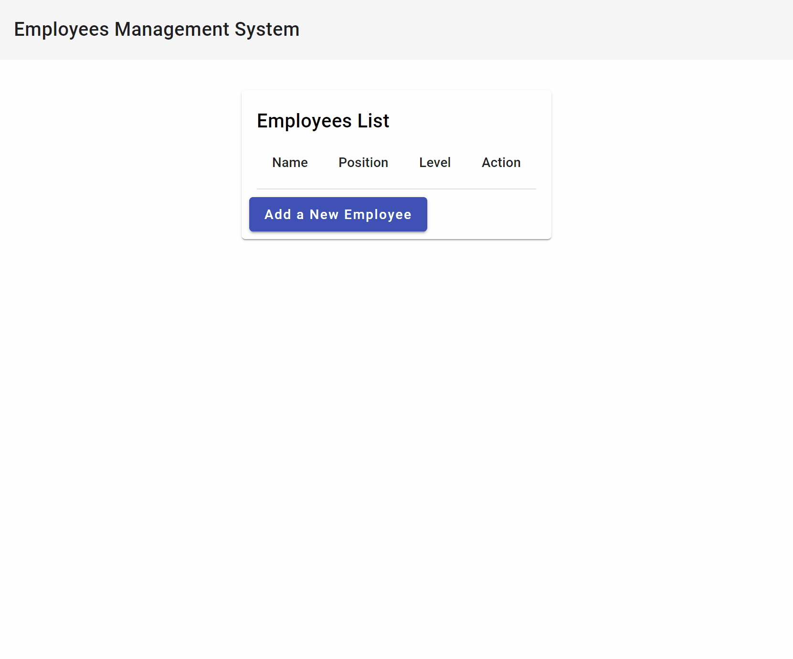
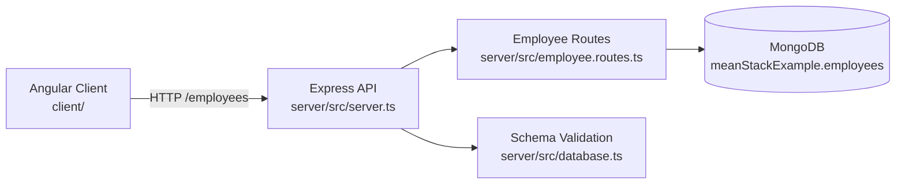

# MEAN Employee Management App with MongoDB

[](https://codespaces.new/mongodb-developer/mean-stack-example)

A full-stack MEAN example that demonstrates CRUD operations for employee records with Angular on the frontend and an Express + TypeScript API on the backend. This repository is intended for developers learning practical MongoDB patterns in a production-style web stack.

Use this app to learn how to model records, validate schema shape in MongoDB, and wire frontend forms to a REST API.



## Capabilities / Features

- Create, list, update, and delete employee records
- Angular UI with editable employee table and form-driven updates
- Express API with TypeScript route handlers for CRUD operations
- MongoDB JSON Schema validation for employee documents
- Seed script for deterministic local demo data
- CI workflow for dependency install, build, lint, and API smoke check

## Tech Stack

- Frontend: Angular 21, Angular Material
- Backend: Node.js, Express, TypeScript
- Database: MongoDB
- Tooling: ESLint, concurrently, GitHub Actions

## Prerequisites

- Node.js 20+
- npm 10+
- A running MongoDB instance (local Docker or MongoDB Atlas)

## Architecture Overview

The Angular app talks to an Express API running on `http://localhost:5200`. The API reads and writes the `employees` collection in MongoDB and applies JSON schema validation during startup.


```mermaid
flowchart LR
    A[Angular Client\nclient/] -->|HTTP /employees| B[Express API\nserver/src/server.ts]
    B --> C[Employee Routes\nserver/src/employee.routes.ts]
    C --> D[(MongoDB\nmeanStackExample.employees)]
    B --> E[Schema Validation\nserver/src/database.ts]
```

## Quick Start

### 1. Install dependencies

```bash
npm install
```

### 2. Configure environment variables

```bash
cp server/.env.example server/.env
```

If you are using MongoDB Atlas, replace `ATLAS_URI` in `server/.env` with your Atlas connection string.

### 3. Seed sample data

```bash
npm run seed
```

Expected outcome: terminal prints that sample employees were inserted into `employees`.

### 4. Start the app

```bash
npm start
```

Expected outcome:

- Angular app: `http://localhost:4200`
- API health endpoint: `http://localhost:5200/healthcheck`

## Run in Codespaces / Dev Container

1. Open this repository in GitHub Codespaces using the badge above.
2. Wait for container initialization to complete.
3. Run the app:

```bash
npm start
```

Expected outcome:

- Angular app: `http://localhost:4200`
- API health endpoint: `http://localhost:5200/healthcheck`

Dev Container image policy:

- MongoDB Atlas Local: `mongodb/mongodb-atlas-local:8.0` (tracks latest 8.0 patch)
- Dev container runtime: `mcr.microsoft.com/devcontainers/javascript-node:1-22-bookworm` (tracks latest 22/bookworm patch)

## Environment Variables

| Name | Required | Example | Description |
| --- | --- | --- | --- |
| `ATLAS_URI` | Yes | `mongodb://localhost:27017/meanStackExample?appName=mean-stack-example` | MongoDB connection string used by server and seed script |
| `PORT` | No | `5200` | Express API port (defaults to `5200`) |

## Project Structure

- `client/` Angular application
- `server/src/` Express API and MongoDB connection logic
- `server/scripts/seed.ts` seed script for demo data
- `AGENTS.md` instructions for coding agents
- `EDD.md` schema contract for MongoDB documents

## API Overview

| Method | Path | Purpose |
| --- | --- | --- |
| `GET` | `/healthcheck` | API readiness check |
| `GET` | `/employees` | List all employees |
| `GET` | `/employees/:id` | Get one employee |
| `POST` | `/employees` | Create employee |
| `PUT` | `/employees/:id` | Update employee |
| `DELETE` | `/employees/:id` | Delete employee |

## MongoDB Features Demonstrated

- JSON Schema validation with `collMod` / `createCollection`
- Typed access to `employees` collection with the Node.js driver
- Reusable connection setup for app runtime and seed workflows

Why MongoDB for this app:

- Flexible document model for iterative employee profile changes
- Built-in schema validation to enforce data quality
- Fast iteration for CRUD use cases common in admin dashboards

Helpful docs:

- [MongoDB Node.js Driver](https://www.mongodb.com/docs/drivers/node/current/)
- [Schema Validation](https://www.mongodb.com/docs/manual/core/schema-validation/)
- [MongoDB Atlas](https://www.mongodb.com/docs/atlas/)

## Testing

Run repository checks:

```bash
npm run build
npm run test
```

Notes:

- `server` tests run ESLint checks.
- `client` tests run Angular/Karma tests.

## Troubleshooting

### 1. `No ATLAS_URI environment variable has been defined`

Fix:

1. Ensure `server/.env` exists.
2. Add a valid `ATLAS_URI` value.

### 2. API starts but UI shows network errors

Fix:

1. Confirm API is running at `http://localhost:5200/healthcheck`.
2. Restart `npm start` and verify no startup errors in the server log.

### 3. Seed script fails to connect

Fix:

1. Ensure MongoDB is reachable at the URI in `server/.env`.
2. For Atlas, whitelist your IP and verify credentials.

### 4. `npm test` fails in headless environments

Fix:

1. Run `npm run test:server` for backend-only verification.
2. Configure a browser launcher (for example, Chrome Headless) for Angular tests.

## Additional Resources

- [Build a MEAN Stack App with MongoDB Tutorial](https://www.mongodb.com/languages/mean-stack-tutorial)

## Contributors

- [Abirami Sukumaran](https://github.com/AbiramiSukumaran)
- [Stanimira Vlaeva](https://github.com/sis0k0)
- [Abdullah Osama](https://www.linkedin.com/in/abdulahosama)
- [Ben Bleything](https://bleything.net/)
- [Jesse Hall @codeSTACKr](https://youtube.com/codestackr/)

## Disclaimer

Use at your own risk. This is not a supported MongoDB product.
